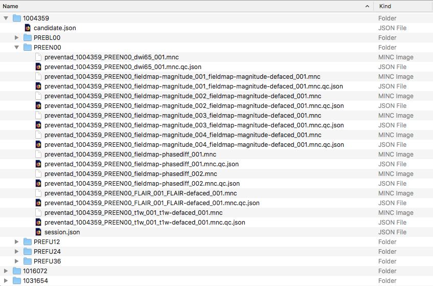
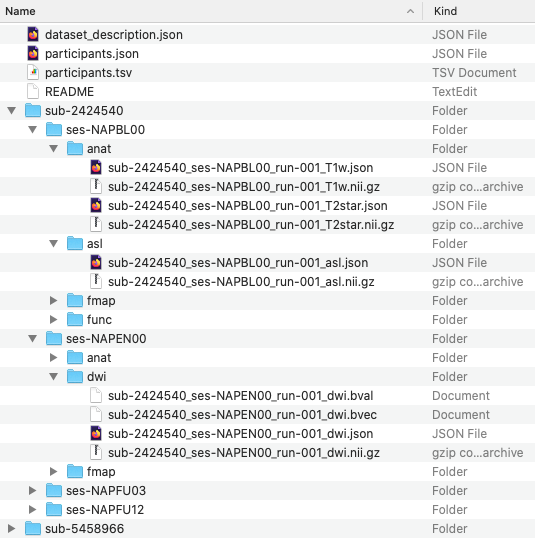

# LORIS MRI Downloader for the open PREVENT-AD dataset
[](https://zenodo.org/badge/latestdoi/183080104)

## 1. Description

Due to the size (~200 GB) of the imaging dataset of the open PREVENT-AD dataset, 
it is not possible to download the entire study’s imaging dataset via the browser. 
However, various ways to download the imaging dataset are provided in this repository. 
 
Users can choose one of the following tool to download the open PREVENT-AD images:
  - a Python script called `LAMID_PREVENT-AD.py`
  - Jupiter Notebook called `LAMID_PREVENT-AD.ipynb` 

See section 2 below for the installation steps required for the tools available in 
this repository.

## 2. Installation and Requirements

Requirements for the script:
- Python 2.7 or Python 3
- the following Python libraries: `getpass`, `json`, `requests`, `os`, `sys`, `getopt`
and `errno`. 

### Installation script (requires Ubuntu and sudo permission)

An install script is provided in this repository to install Python and all its dependencies.

Note that the script will only work on Ubuntu machines and requires sudo permission.

To run the install script:
```bash
sudo bash install_LAMID_PREVENT-AD.sh
```

### Manual installation

1. Install python 2.7 or python 3 and `pip`

2. To install the python libraries using `pip`, run the following commands:

```bash
pip install getpass
pip install json
pip install requests
pip install os
pip install sys
pip install getopt
pip install errno
```


## 3. Downloading the MRI from the open PREVENT-AD LORIS API

### 3.1 Using `LAMID_PREVENT-AD.py`

In order to download the images from the open PREVENT-AD LORIS API, run the following
command to see the options that can be provided to the script:

`python LAMID_PREVENT-AD.py -h`

This will print in the terminal the following guide:

```

This tool facilitates the download of the open PREVENT-AD dataset. Data are provided under two different formats:
	 - data organized according to the BIDS standard or 
	 - data available under the MINC format.
By default, the data will be downloaded according to the BIDS standard.

usage  : LAMID_PREVENT-AD.py -o <outputdir> [ -t { bids | minc } ] [ -m modality[, ... ] ]  [ -v visit_label[, ... ] ] 

options: 
	-o, --outputdir  : path to the directory where the downloaded files will go 
	-t, --type       : data organization - available options: <bids> or <minc>, default to <bids>
	-m, --modalities : comma-separated list of modalities to download. By default all modalities will be downloaded. Available modalities are: asl,bold,dwi65,qT2star,fieldmap,FLAIR,MP2RAGE,t1w,T2star,t2w,task-encoding-bold,task-retrieval-bold
	-v, --visitlabels: comma-separated list of visit labels to download. By default all visits will be downloaded. Available visit labels are: NAPBL00,NAPEN00,NAPFU03,NAPFU12,NAPFU24,NAPFU36,NAPFU48,PREBL00,PREEN00,PREFU12,PREFU24,PREFU36,PREFU48

```

Note, by default: all images will be downloaded in the current working directory in BIDS format. 
However:
  - if you wish to download the images in a different directory, you can specify it when 
  running the script with the option `-o` as follows: 
  
  `python LAMID_PREVENT-AD.py -o %PATH_TO_DIRECTORY%` with `%PATH_TO_DIRECTORY%` being replaced 
  by the path to the directory where you want the files to be downloaded in.
  
  - if you wish to download the images in MINC format, you can specify it when running the script
  with the option `-t` as follows: 
  
  `python LAMID_PREVENT-AD.py -t minc`
  
  - if you wish to download only the images of a specific modality(ies), you can specify it(them) when running
  the script with the option `m` as follows (example of t1w and FLAIR): 
  
  `python LAMID_PREVENT-AD.py -t t1w,FLAIR`
  Available modalities are: asl, bold, dwi65, qT2star, fieldmap, FLAIR, MP2RAGE, t1w, T2star, t2w, 
  task-encoding-bold, task-retrieval-bold
  
  - if you wish to download images of specify visit label(s), you can specify them it(them) when running
  the script with the option `-v` as follows (example of baseline visits): 
  
  `python LAMID_PREVENT-AD.py -v PREBL00,NAPBL00`
  Available visit labels are: NAPBL00, NAPEN00, NAPFU03, NAPFU12, NAPFU24, NAPFU36, NAPFU48, 
  PREBL00, PREEN00, PREFU12, PREFU24, PREFU36, PREFU48

A mix of all these options can be used to execute the script.


### 3.2 Using Jupiter Notebook

Open the Jupiter Notebook file `LAMID_PREVENT-AD.ipynb` in Jupiter
Notebook and execute the code in the notebook.


## 4. Organisation of the downloaded structure

### 4.1 Organisation of the downloaded structure when downloading the dataset in MINC

Below is a screenshot of the organization of a subset of the downloaded data.



All images are organized by candidate’s 7 digits ID and visit labels. 

After download, the open PREVENT-AD data should contain 232 candidate folders. 
* Within each candidate folders, a `candidate.json` file with basic demographic 
information (Gender, Language, etc.) and several visit folders can be found.
* Within each candidate's visit folder, a `session.json` file, MINC images and 
QC information (in a JSON file) are available per modality acquired in the MRI session. 
  * All MINC images are labelled as follows: `preventad_DCCID_VisitLabel_ScanType_ScanNumber.mnc`.
    More details about the MINC format can be found at 
    https://en.wikibooks.org/wiki/MINC/SoftwareDevelopment/MINC2.0_File_Format_Reference 
  * The QC information JSON file of a given MINC has the same name as the MINC file 
    associated with the QC information with `.qc.json` added at the end of the image name. 
    This JSON file contains image QC information (QC Status, Caveats, etc.)
  * The `session.json` information file contains information pertinent to the session 
    (Age at MRI, Subproject, etc.)

### 4.1 Organisation of the downloaded structure when the dataset in BIDS

Below is a screenshot of the organization of a subset of the downloaded data.



All images are organized according to the BIDS standard. For more information
on the BIDS standard, please visit https://bids.neuroimaging.io.
